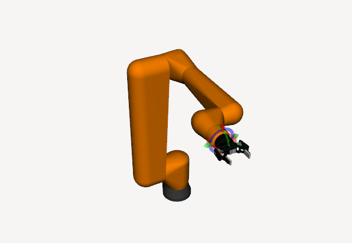

# Fanuc CRX-10iAL + Robotiq 2F-85 - MoveIt 2



## Overview
This repository documents the **end-to-end MoveIt 2 bringup** of a **Fanuc CRX-10iAL** collaborative robot with a **Robotiq 2F-85 gripper** using **ROS 2 Humble**.

The goal was to achieve:
- RViz-only simulation (no Gazebo)
- Stable ros2_control integration
- MoveIt planning & execution
- Proper gripper actuation using a single master joint
- Clean bringup architecture

---

## System Architecture

**ROS 2 Humble**
- robot_state_publisher
- ros2_control
- joint_state_broadcaster
- JointTrajectoryController (arm)
- GripperActionController (gripper)
- MoveIt 2 (OMPL / CHOMP)
- RViz Motion Planning Plugin

---

## Robot Description
- URDF generated via Xacro
- 6-DOF Fanuc arm
- Robotiq 2F-85 attached at `tool0`
- Gripper uses **one actuated joint (`finger_joint`)**
- Remaining gripper joints are mimic + passive

---

## Controllers

### Arm Controller
- `joint_trajectory_controller/JointTrajectoryController`
- Position interface
- 6 joints

### Gripper Controller
- `position_controllers/GripperActionController`
- Single joint: `finger_joint`
- Action-based interface (required by MoveIt)

---

## MoveIt Configuration
- Groups:
  - `arm`: base_link → tool0
  - `gripper`: finger_joint
- End effector properly declared
- Collision matrix heavily pruned for Robotiq internals
- CHOMP + OMPL supported

---

## How to Run

```bash
ros2 launch fanuc_bringup bringup.launch.py
```

This launches:
- robot_state_publisher
- ros2_control
- controllers
- move_group
- RViz Motion Planning UI

---

## Known Limitations
- No Gazebo physics
- No force/torque feedback
- Gripper collision geometry simplified

---

## Status
✅ Planning  
✅ Execution  
✅ Arm control  
✅ Gripper open/close  

---

## Debugging Log 🐞

This project involved extensive debugging across **ros2_control, MoveIt 2, controllers, and gripper integration**.

All errors, root causes, and fixes are documented here:  
➡️ **[DEBUGGING.md](DEBUGGING.md)**

---

## Credits
Fanuc CRX URDF, Robotiq 2F-85 model, ROS 2, MoveIt 2
